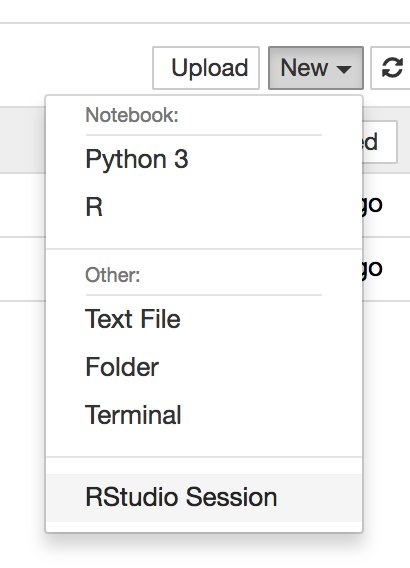

Proteomics Shortcourse
----------------------

R shiny apps for proteomics.

- Evaluation of decoy quality
- Differential analysis using MSqRob

Getting started
----------------

- Launch an R studio interface in an R docker along with bioconductor packages for proteomics.

Once inside Jupyter Notebook, RStudio Server should be an option under the menu
"New":

