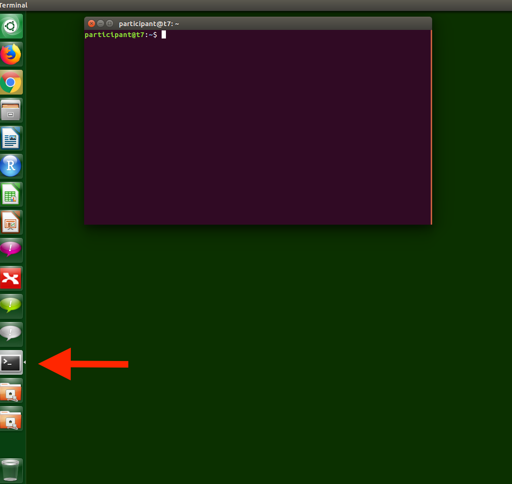
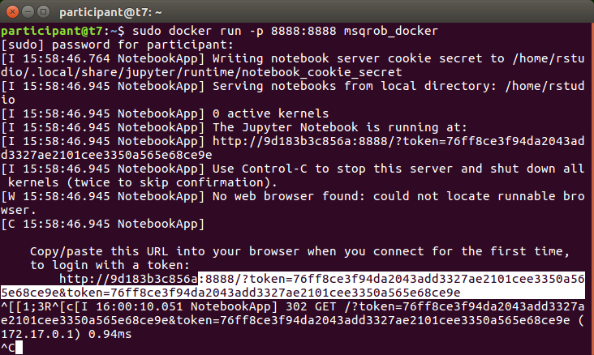
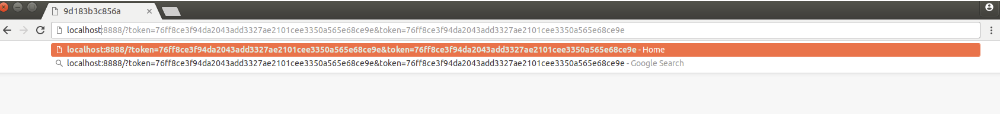
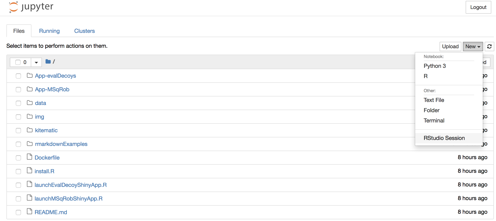

This is only necessary in the PC rooms the online docker that is linked to the github repository of the course times out when you do not interact with it for several minutes. 

#Install the Docker on the local machines.

You only have to do that once for every machine.

1. Open a terminal


2. type

```
sudo docker load -i /media/GTPB_Shared_Drive/To_Participant/statsDocker/msqrob_docker.tar
```

You have to run the command as a super user (sudo) because normal users do not have the permission to launch docker on the PCs in the tutorial roam.
The `docker` command launches docker.
The `load` command will enable a new docker to be installed locally.
The switch `-i` stand for input
Then we give the full path to the docker, which is available on the share.


Now the docker installations starts.

#Launch the Docker

1. Open a terminal

2. Launch the docker by typing the command.

```
sudo docker run -p 8888:8888 msqrob_docker
```

You have to run the command as a super user (sudo) because normal users do not have the permission to launch docker on the PCs in the tutorial roam.
The `docker` command launches docker.
The `run` command enables you to launch a Docker.
The `-p 8888:8888` command is used to listen to port 8888 of the docker and to pipe it to the port 8888 on the local machine.
The will enable us to view the jupyter server in the Docker via a webbrowser.

We can interact with the docker via a web browser.

3. Open Chrome

type

```
localhost:8888
```
in the location bar and copy the long token from the terminal after the 8888 in Chrome.
Copy in linux is possible via highlighting text. Pasting can be done by pushing the middle mouse button.




Press enter! Then the jupyter hub environment will launch.



Select New>Rstudio Session to launch the statistical software R.
Now an interactive statistical programming environment will open in the browser that runs on a cloud server.
